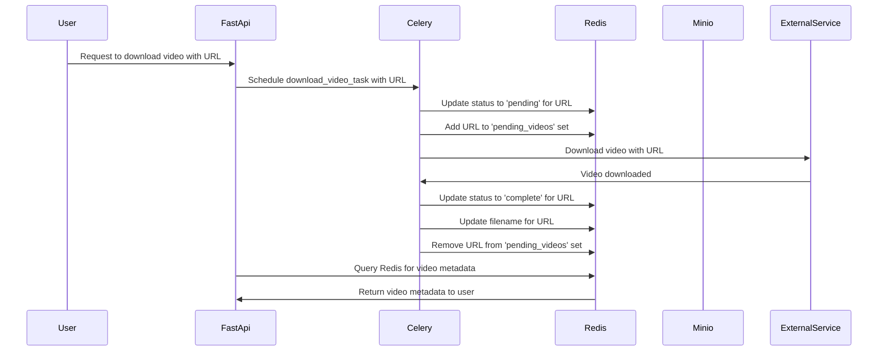
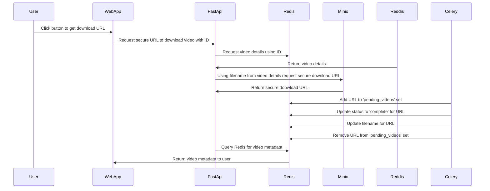

## Asynchronous Video Downloading and Processing with FastAPI, Celery, Redis, Minio all on Docker

This project uses [FastAPI](https://github.com/tiangolo/fastapi), [Celery](https://github.com/celery/celery), [Redis](https://redis.io/), [Minio](https://min.io/) and [Docker](https://www.docker.com/) serve a video downloading and processing service.

## How it works





## Want to use this project?

Spin up the containers:

```sh
docker-compose up -d --build
```

Open your browser to [http://localhost:8004](http://localhost:8004) to view the app or to [http://localhost:5556](http://localhost:5556) to view the Flower dashboard.

The API documentation and testing can be found at [http://localhost:8004/docs](http://localhost:8004/docs)

You can login to Minio at [http://localhost:9001/browser](http://localhost:9001/browser).

Use [http://localhost:8081/](http://localhost:8081/) to view the Redis Commander dashboard.

Trigger a new task:

```sh
curl -X 'POST' 'http://localhost:8004/task' -H 'accept: application/json' -H 'Content-Type: application/json' -d '{"url": "https://www.youtube.com/watch?v=DmH6YPWhaDY"}'
```

Check the status:

```sh
curl http://localhost:8004/tasks/${TASK_ID}
```

## Tasks:

- [x] Allow user to download video from url to server
- [x] Store and show details about video
- [x] Store video in object storage and securly download it
- [ ] Make task list persistant.
- [ ] List of videos downloaded. 
- [ ] Prevent downloading video multiple times/check if exists and just link that.
- [ ] Bring tests in line with features
- [ ] Allow users to split videos into clips automaticlly and view them
- [ ] Allow users to post clips to Imgur
- [ ] Allow users to create posts to Reddit
- [ ] User account and authentication so people can see their jobs and videos.
- [ ] Deploy to Cloud services


## Credits

This project was inspired by this [post](https://testdriven.io/blog/fastapi-and-celery/) by [testdrivenio](https://github.com/testdrivenio).
